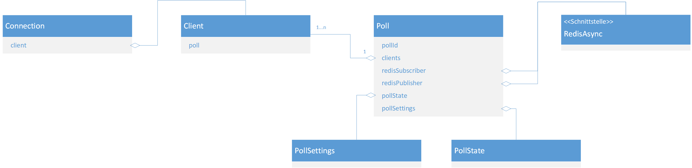

# live-poll

Live-poll is a distributed system for creating polls with multiple participants and live evaluation.

It is designed to work as a distributed system to handle a lot of clients. Each poll has a unique id, wich can be freely chosen.

## architecture

The following schema creates an abstract overview of the application.



## local installation

install dependencies with lerna:
```sh
npm i
npx lerna bootstrap
```

build the client app

```sh
cd client
npm run build
```

create a `live-poll.config.json` file, with the following entries:

```json
{
    "port": "80",
    "hostname": "0.0.0.0",
    "serviceName": "live_poll",
    "redis": {
        "url": "redis"
    }
}
```

start the app with docker-compose

```
docker-compose up
```

test the scalability:

```
docker-compose up --scale live-poll=3
```
